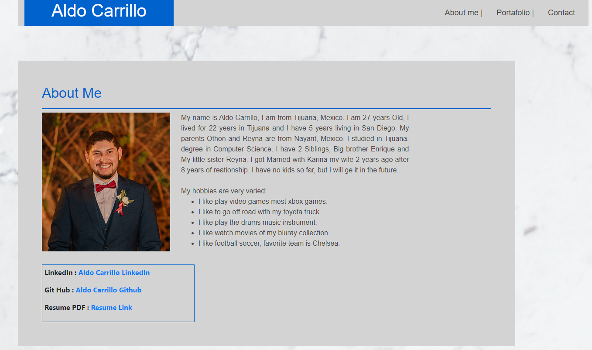

# HW8-PortafolioUpdate

## About
The Portfolio Update is a personal webpage where the programmer share our projects, this time the portafolio has the info and the links to our most recent projects we been working during the bootcamp.

## Usage
* The Main page has te About Me info, is a short story about the programmer personal life and experience.
    - At the Bottom of the page has the links to:
        1. Linkedin Profile
        2. GitHub Page
        3. Resume

* The Portfolio page has the links to a webpage more detailed of each project named on it.
* The Contact page has the info to contact the programmer.

## Credit
- [Aldo Carrillo](https://github.com/AldoCarrillo)

## Homepage

link : https://aldocarrillo.github.io/HW8-PortafolioUpdate/index.html

## License
MIT License

Copyright (c) [year] [fullname]

Permission is hereby granted, free of charge, to any person obtaining a copy
of this software and associated documentation files (the "Software"), to deal
in the Software without restriction, including without limitation the rights
to use, copy, modify, merge, publish, distribute, sublicense, and/or sell
copies of the Software, and to permit persons to whom the Software is
furnished to do so, subject to the following conditions:

The above copyright notice and this permission notice shall be included in all
copies or substantial portions of the Software.

THE SOFTWARE IS PROVIDED "AS IS", WITHOUT WARRANTY OF ANY KIND, EXPRESS OR
IMPLIED, INCLUDING BUT NOT LIMITED TO THE WARRANTIES OF MERCHANTABILITY,
FITNESS FOR A PARTICULAR PURPOSE AND NONINFRINGEMENT. IN NO EVENT SHALL THE
AUTHORS OR COPYRIGHT HOLDERS BE LIABLE FOR ANY CLAIM, DAMAGES OR OTHER
LIABILITY, WHETHER IN AN ACTION OF CONTRACT, TORT OR OTHERWISE, ARISING FROM,
OUT OF OR IN CONNECTION WITH THE SOFTWARE OR THE USE OR OTHER DEALINGS IN THE
SOFTWARE.